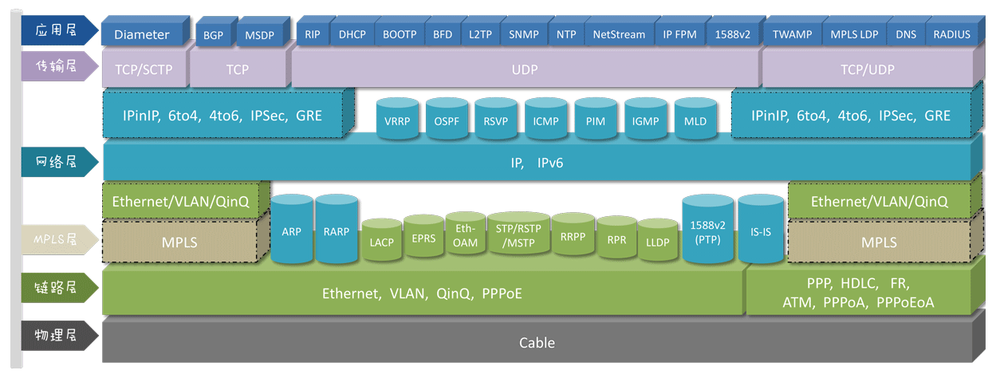

## 计算机网络
----

协议地图

### 交换机

----

交换机是工作物理层，数据链路层的设备。

交换机的主要作用是

- 连接多个以太网物理段，隔离冲突段
- 对以太网帧进行高速而透明的交换转发
- 自我学习和维护 MAC 地址信息

二层交换机可以识别数据包中的 MAC 地址信息，根据 MAC 地址进行转发，并将这些 MAC 地址与对应的端口记录在自己的 MAC 地址表中。具体的学习流程如下：
（1） 当交换机从某个端口收到一个数据包，它先读取包头中的源 MAC 地址，这样它就知道源 MAC 地址的机器是连在哪个端口上的；
（2） 再去读取以太网帧中的目的 MAC 地址，并在地址表中查找相应的端口；
（3） 如表中有与这个目的MAC地址对应的端口，把以太网帧直接复制到这个端口上；
（4） 如表中找不到相应的端口，则把数据包广播到所有端口上，当目的机器对源机器回应时，交换机又可以学习一目的 MAC 地址与哪个端口对应，在下次传送数据时就不再需要对所有端口进行广播了。
　　不断的循环这个过程，对于全网的MAC地址信息都可以学习到，二层交换机就是这样建立和维护它自己的地址表。

> 交换机对以太网帧的转发和过滤

1、单播帧的转发

交换机根据以太网帧中目的 MAC，查询MAC地址表，并从相应的端口转发出去；其他端口不转发此以太网帧

2、广播，组播和未知播的转发

交换机会把广播，组播和未知播的以太网帧从所有端口转发出去（除了受到该以太网帧的端口）

> 广播风暴

所谓广播帧就是在二层环境中设备发出的广播帧在广播域中传播，这样会导致广播帧占用网络带宽，降低设备性能，形成广播风暴。

那么，解决广播风暴有两个思路，一是增加路由器三层设备，从而隔离广播域；二是使用vlan(虚拟局域网)隔离广播域。

以vlan为例，常见的vlan划分方法包括：

- 基于端口的 VLAN

就是将一个或多个端口划分到一个 VLAN，优点是配置简单，只要插入交换机的某个端口即从属于某个 VLAN，缺点是用户更换的交换机端口，也就改变了 VLAN ID，不方便维护。

- 基于MAC地址的 VLAN

就是将一个或多个 MAC地址划分到一个 VLAN，优点是对用户来讲，不用关心交换机的某个端口，缺点是较基于端口的配置相对繁琐。

- 基于协议的 VLAN

就是将运行相同协议的端口划分到一个 VLAN，优点是不受端口物理位置的影响，缺点是真正运行的协议太少，有划分 VLAN 数量的限制。

- 基于子网的 VLAN

就是将同一个子网划分到一个 VLAN。

> VLAN交换机的链路类型

VLAN 交换机一般有三种链路类型，Access ， Trunk，Hybrid链路类型。

Access 链路类型的特点是指允许缺省的 VLAN 通过，同时仅发送和接收一个 VLAN 的数据帧，常用于交换机连接用户设备之间。

Trunk ：允许多个 VLAN 通过，可以接收和发送多个 VLAN 的数据帧。同时对于缺省的 VLAN 也就是 PVID 的以太网帧是不带标签的。常用于交换机与交换机之间的链接。

Hybrid：属于多个 VLAN，可以接收和发送多个 VLAN 报文。 Hybrid 端口和 Trunk 端口的不同之处在于 Hybrid 端口可以允许多个 VLAN 的报文发送时不打标签，而 Trunk 端口只允许缺省 VLAN 的报文发送时不打标签。

### ARP协议

ARP协议，即地址解析协议，将 IP 解析在 MAC 地址

RARP协议，即逆地址解析协议，将 MAC 地址映射为 IP。

链接：http://www.023wg.com/message/message/cd_feature_ARP_message_format.html

ARP请求：

1. dst mac 为 `ff:ff:ff:ff:ff:ff`，即广播报文
2. arp 请求中包含发送端的 ip 和 mac，这样接收端收到后可以建立自己的 ARP 表

ARPy应答：

1. 单播报文，dst mac 为 arp 请求中 sender mac，src mac 为自身mac
2. 携带信息为 `sender mac` 和 `sender ip`  为自身信息，`target mac` 和 `target ip` 为 arp 请求中的 sender

所以，arp请求报文为广播报文，而arp应答为单播报文。

> ARP工作在第几层

1）从功能上来讲，ARP服务于数据链路层；2）从数据包的封装和解封装来看，ARP属于第三层，网络层；3）MPLS层，即2.5层。

> 什么是代理ARP

当 ARP 请求目标跨网段时，网关设备收到 ARP 请求，会用自己的 MAC 地址返回给请求者，这就是代理ARP。

当主机没有网关时，采用代理ARP；当主机有网关时，采用正常ARP。

### 三层设备

----

三层即IP层，其最重要的功能就是IP选路，需要路由的数据报文既可以由本机产生，也可以由其他设备产生（这种情况下，需要配置本机为路由器模式，否则报文会被丢弃）。👇下图是IP选路的基本工作原理。

IP 选路的策略和优先级，即搜索路由表的顺序为

1）搜索匹配的本机地址

2）搜索匹配的网络地址

3）搜索默认表项

**路由表**

Flags 各项的含义：

- U 该路由可用
- G 该路由是一个网关，如果没有该标志，则是直接路由
- H 该路由是一个主机，如果没有该标志，则是一个网络
- D 该路由是由重定向报文创建的
- M 该路由被ICMP重定向报文修改过

**路由表的分类**

根据路由表的产生方式，可分为直接路由，静态路由，缺省路由，动态路由。

**直接路由**：路由器接口上配置的网段地址会自动出现在路由表中并与接口关联，这种路由为直接路由。直接路由是由链路层自动发现，当路由器检测到端口down掉后，会自动删除该路由。

当路由器的接口配置了网络协议地址并状态正常时，即物理连接正常，并且可以正常检测到数据链路层协议的keepalive信息时，接口上配置的网段地址自动出现在路由表中并与接口关联。其中产生方式(owner)为直连(direct)，路由优先级为0，拥有最高路由优先级；其 metric 值为 0，表示拥有最小metric值；

**静态路由**：由管理员手动添加的路由成为静态路由。

静态路由可以通过 `ip`, `route` 命令进行配置，一条静态路由要包含以下几个要素：

- 目标地址：即IP包的目的地址或目的网络
- 网络掩码：和目标地址一起表示目的网络
- 下一跳 IP 地址：即 IP 包所经由的下一个 IP 地址
- 接口（Interface）：即 IP 包从哪个接口发出
- distance-metric：表示路径花费，值越小，越优先

**缺省路由**：缺省路由也是一个路由条目，表示在没有匹配路由条目时，按照缺省路由中的下一跳 IP 地址和接口进行转发

缺省路由既可以手动添加，也可以一些动态路由协议生成。使用缺省路由可以极大地减少路由表条目，同时如果配置错误，则可能导致路由环路，或非最佳路由。

**动态路由**：动态路由可以自动学习和记忆网络运行情况，在需要时自动计算数据传输的最佳路由。它适应大规模的复杂的网络环境下的应用，所有的动态路由协议在TCP/IP协议栈中都属于应用层的协议，但是不同的路由协议使用的底层协议不同。

OSPF工作在网路层,将协议报文直接封装在IP报文中，协议号89，由于IP协议本身是不可靠传输协议，所以OSPF传输的可靠性需要协议本身来保证。

BGP工作在应用层,使用TCP作为传输协议，提高了协议的可靠性，TCP 的端口号是 179。

RIP工作在应用层,使用UDP作为传输协议，端口号520。

路由的优先级，其范围0-255。需要指明的是必须是完全相同的一条路由才进行路由优先级的比较，例如 `10.0.0.0/16` 和 `10.0.0.0/24` 是两条不同的路由，所以不进行优先级的比较，而是而直接按最长掩码匹配。

### TCP/UDP

----

TCP header结构

> 1、TCP三次握手和四次挥手

**三次握手**流程图

详细说明：

第一次握手

Client什么都没有确认

Server确认Client发送正常

第二次握手：

Client确认自己发送/接收正常，对方发送/接收正常

Server确认自己接收正常，Client发送正常

第三次握手：

Server确认自己发送/接收正常，Client发送/接收正常

因此，三次握手最重要的就是保证连接是双工。

**四次挥手流程图**

> 为什么建立连接是三次，而关闭连接是四次？

1）建立连接， Server 收到 SYN=1 后，把 ACK， SYN 放到一个数据包里发送给Client

2）关闭连接，当收到对方 FIN 包，表示对方不再发送数据，但是还能接收数据，这个时候还允许发送数据到对方，当数据确认已经发送完毕时，才向对方发送 FIN 包。所以 ACK 和 FIN 包是分开的。

> 3、为什么要有TIME_WAIT状态

TIME_WAIT状态是主动关闭的一方，在发送最后一个 ACK 后进入`time_wait`状态，然后保持 2MSL 时间才能回到初始状态。

MSL是数据包在网络中的最大生存时间。产生这种结果使得这个TCP连接在2MSL连接等待期间，定义这个连接的四元组（客户端IP地址和端口，服务端IP地址和端口号）不能被使用。

1）为实现TCP全双工连接的可靠释放

假设发起主动关闭的一方（client）最后发送的 ACK 在网络中丢失，由于TCP协议的重传机制，执行被动关闭的一方（server）将会重发其FIN，在该FIN到达client之前，client必须维护这条连接状态，也就说这条TCP连接所对应的资源（client方的local_ip,local_port）不能被立即释放或重新分配，直到另一方重发的FIN达到之后，client重发ACK后，经过2MSL时间周期没有再收到另一方的FIN之后，该TCP连接才能恢复初始的CLOSED状态。如果主动关闭一方不维护这样一个TIME_WAIT状态，那么当被动关闭一方重发的FIN到达时，主动关闭一方的TCP传输层会用RST包响应对方，这会被对方认为是有错误发生，然而这事实上只是正常的关闭连接过程，并非异常。

2）为使旧的数据包在网络因过期而消失

为说明这个问题，我们先假设TCP协议中不存在TIME_WAIT状态的限制，再假设当前有一条TCP连接：(local_ip, local_port, remote_ip,remote_port)，因某些原因，我们先关闭，接着很快以相同的四元组建立一条新连接。本文前面介绍过，TCP连接由四元组唯一标识，因此，在我们假设的情况中，TCP协议栈是无法区分前后两条TCP连接的不同的，在它看来，这根本就是同一条连接，中间先释放再建立的过程对其来说是“感知”不到的。这样就可能发生这样的情况：前一条TCP连接由local peer发送的数据到达remote peer后，会被该remot peer的TCP传输层当做当前TCP连接的正常数据接收并向上传递至应用层（而事实上，在我们假设的场景下，这些旧数据到达remote peer前，旧连接已断开且一条由相同四元组构成的新TCP连接已建立，因此，这些旧数据是不应该被向上传递至应用层的），从而引起数据错乱进而导致各种无法预知的诡异现象。作为一种可靠的传输协议，TCP必须在协议层面考虑并避免这种情况的发生，这正是TIME_WAIT状态存在的第2个原因。

> 、为什么会有UDP协议

UDP 是面向无链接的不可靠传输。

一个重要的原因是**IP协议中并没有端口(port)**的概念。IP协议进行的是 IP 到 IP 地址的传输，两台计算机之间的对话。但每台计算机中需要有多个通信通道，并将多个通信通道分配给不同的进程使用。**一个端口就代表了这样的一个通信通道**。UDP协议实现了端口，从而让数据包可以在送到IP地址的基础上，进一步可以送到某个端口。

在使用TCP协议传输数据时，如果一个数据段丢失或者接收端对某个数据段没有确认，发送端会重新发送该数据段。TCP重新发送数据会带来传输延迟和重复数据，降低了用户的体验。**对于迟延敏感的应用，少量的数据丢失一般可以被忽略，这时使用UDP传输将能够提升用户的体验**。

> 5、为什么UDP需要长度字段，而TCP不需要？

翻译一下就是：**UDP length字段是冗余的，它等于IP total length 减去IP header。**

长度字段是多余的，因为IP标头和UDP标头都具有长度字段。我唯一想到这种冗余的原因是，发生这种情况是因为UDP是一次设计的，目前尚不清楚IP协议套件的外观。

所有合法的UDP数据包都应具有一个长度字段，该长度字段与IP报头中的长度字段可以精确地匹配。如果您不这样做，则无法确定接收方将如何处理数据包。

长度字段不一致的

UDP数据包在Internet上很常见。我猜他们正在探测缓冲区溢出，如果将一个长度字段用于分配内存，而将另一个长度字段用于将数据复制到分配的缓冲区时，则可能会发生这种情况。

在较新的UDP Lite协议中，长度字段已被重新利用。 UDP Lite报头中的length字段并不指示数据包中有多少数据，而是指示校验和已覆盖了其中的多少数据。 UDP Lite数据包中的数据长度始终是根据IP标头中的长度字段计算的。这是UDP和UDP Lite标头格式之间的唯一区别。

> 、TCP的流量控制

*什么是流量控制？流量控制的目的？*

如果发送者发送数据过快，接收者来不及接收，那么就会有分组丢失。为了避免分组丢失，控制发送者的发送速度，使得接收者来得及接收，这就是流量控制。

流量控制根本目的是防止分组丢失，它是构成TCP可靠性的一方面。

*如何实现流量控制？*

由滑动窗口协议（连续ARQ协议）实现。滑动窗口协议既保证了分组无差错、有序接收，也实现了流量控制。主要的方式就是接收方返回的 ACK 中会包含自己的接收窗口的大小，并且利用大小来控制发送方的数据发送。

> 7、流量控制引发的死锁*？*怎么避免死锁的发生*？

当发送者收到了一个窗口为0的应答，发送者便停止发送，等待接收者的下一个应答。但是如果这个窗口不为0的应答在传输过程丢失，发送者一直等待下去，而接收者以为发送者已经收到该应答，等待接收新数据，这样双方就相互等待，从而产生死锁。
为了避免流量控制引发的死锁，TCP使用了**持续计时器**。每当发送者收到一个零窗口的应答后就启动该计时器。时间一到便主动发送报文询问接收者的窗口大小。若接收者仍然返回零窗口，则重置该计时器继续等待；若窗口不为0，则表示应答报文丢失了，此时重置发送窗口后开始发送，这样就避免了死锁的产生。

### VXLAN技术

VXLAN 是一种常见的网络虚拟化技术，其原理是将Ethernet帧封装在 UDP 中，加上8 字节的 vxlan 头部，从而标识不同的二层网络。

vxlan 数据包由 VTEP (Vxlan Tunnel EndPoint)进行封装和解封装。

vxlan header 结构

1 个字节等于 8 个比特位。vxlan header 结构说明：

前 8 个 bit 位为 Flags 字段，`I` 必须置为 1 ，代表 VNI 有效；24bit 的 VXLAN Network Identifier 为 overlay 网络标识号；其他Reserved字段必须置为 0 。

$$ 2^{24} = 16 * 2^{20} = 16 M$$

所以，vxlan共支持1600万个不同的二层网络。

经常与vxlan一起对比的是vlan，下面我们看下vlan的header结构

vlan 是直接在 Ethernet 帧头部增加 4 个字节的 `vlan tag`， 用于表示不同的二层网络。

vlan header结构

`PRI` 3bit，表示帧的优先级，值越大优先级越高；

`CFI (Canonical Format Indicator)` 1bit，表示MAC地址是否是经典格式。CFI为0说明是标准格式，CFI为1表示为非标准格式。用于区分以太网帧、FDDI（Fiber Distributed Digital Interface）帧和令牌环网帧。在以太网中，CFI的值为0。

`VID` 12bit，表示帧所属的vlan，三个特殊的VID：

- 0x000：设置优先级但无VID
- 0x001：缺省VID
- 0xFFF：预留VID

$$ 2^{12} = 4096 $$ 即最大支持4096（除去特殊VID，即4094）个不同的二层网络

> 为什么要用VXLAN?

1）vlan ID的限制，vlan 4096个，vxlan 16M个，但是如果用802.1 AD QinQ协议，即加 2 个vlan tag，总共也有16M个不同的二层网络。

2）交换机 MAC 表的问题

vlan将带来 mac 表暴增，而vxlan将二层帧放在UDP数据包中，其外层的二三层信息相对固定

3）虚机的迁移和部署

vxlan 是在L3 网络上构建了 L2 网络，物理网络二层边界还在，但是虚机的网络数据在三层传输，可以跨越物理网络二层的限制。

4）vlan 无法做负载均衡，使用 STP 管理多条线路；而 vxlan 在三层传输，可以作负载均衡

> vxlan 和 vlan的最大区别

vlan 只是修改了原始的 Ethernet 帧，整个数据包还是原来的数据包；但是 vxlan 将原始的 Ethernet 帧隐藏在了 UDP 数据包中，从网络中只看到 VTEP 间，UDP 数据的传输。

参考资料：

vxlan RFC 7348 https://tools.ietf.org/html/rfc7348

Vlan http://www.023wg.com/message/message/cd_feature_eth_vlan.html

### HTTP/HTTPS

----

> 1、http与https的区别

- HTTP 明文传输，数据都是未加密的，安全性较差，HTTPS（SSL+HTTP）数据传输过程是加密的，安全性较好。
- HTTPS 协议需要到 CA（Certificate Authority，数字证书认证机构） 申请证书，一般免费证书较少，因而需要一定费用。
- HTTP 页面响应速度比 HTTPS 快，主要是因为 HTTP 使用 TCP 三次握手建立连接，客户端和服务器需要交换 3 个包，而 HTTPS除了 TCP 的三个包，还要加上 ssl 握手需要的 9 个包，所以一共是 12 个包。
- http 和 https 使用的是完全不同的连接方式，用的端口也不一样，前者是 80，后者是 443。
- HTTPS 其实就是建构在 SSL/TLS 之上的 HTTP 协议，所以，要比较 HTTPS 比 HTTP 要更耗费服务器资源。

> 2、https的加密过程

HTTPS加密过程：

1. 客户端请求服务器获取 **证书公钥**
2. 客户端(SSL/TLS)解析证书（无效会弹出警告）
3. 生成随机值
4. 用**证书公钥**随机值生成**密钥**
5. 客户端将**密钥**发送给服务器
6. 服务端用**私钥**解密**密钥**得到随机值【4，5，6非对称加密/解密】
7. 将信息和随机值混合在一起，进行对称加密
8. 将加密的内容发送给客户端
9. 客户端用**密钥**解密信息

参考资料：https://segmentfault.com/a/1190000019976390

> 3、http协议

- HTTP (Hypertext transfer protocol) 超文本传输协议
- HTTP 协议在 7 层传输架构中属于应用层协议，其依赖 TCP 协议
- HTTP 协议由请求和响应两部分组成，是一个标准的客户端服务器模型
- HTTP 默认端口号 80，https 默认端口号 443
- HTTP 协议通过 URL（统一资源定位符 - Uniform-Resource-Locator）来定位互联网上的资源地址
- HTTP 是一个无状态的面向连接的协议，无状态不代表 HTTP 不能保持长连接，无状态指的是 HTTP 不具备事务记忆能力，也就是下一次的请求不会记住上一次的请求信息。
- HTTP 协议 0.9 和 1.0 版本使用非持续性连接，也就是一次请求一次响应，连接就会关闭，而从 HTTP 协议 1.1 开始，默认开启了 Keep-Alive，保持长连接，就是说一次请求结束后，连接不会马上关闭，下一次请求会继续使用这个连接，但长连接不代表一直不关闭，一段时间后这个连接就会关闭。

### BGP协议

BGP协议，即边界网关协议，其定义为核心，去中心化自洽路由协议。

BGP 协议既支持应用在一个 AS 内部，也支持应用在 AS 间。AS 内部为 `iBGP` 协议，AS 间为 `eBGP` 协议。

BGP header 结构

BGP 数据类型，分四种

- Open

TCP 连接建立后，bgp 发送的第一个报文，bgp peer 回 keepalive 确认 Open

- Update

首次，交换整个BGP router table；之后只发送变化了的路由

- Notification

出错时发送的消息，一旦发送，bgp 会中断

- Keepalive

只有 header 信息，bgp session hold time。

>iBGP 和 eBGP的区别

传递路由时，对 `next-hop` 处理不同，`eBGP` 修改路由 `next-hop` 再转发，目的是为了将流量引入自己；而 `iBGP` 不修改，直接转发。